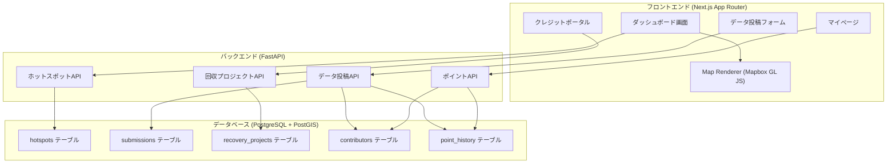
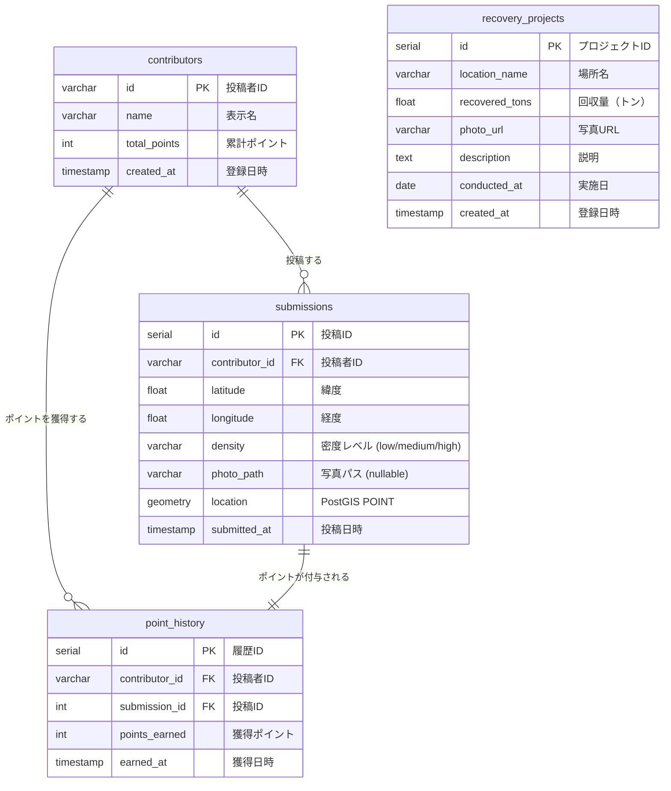

# 設計書: CLEAN-THE-SEA

## 概要

CLEAN-THE-SEAは、海洋プラスチック汚染データの可視化、データ収集、クレジット取引モックを提供するMVP Webアプリケーションである。フロントエンドはNext.js (App Router) + React + Tailwind CSSで構築し、地図描画にMapbox GL JSを使用する。バックエンドはPython FastAPIで構築し、PostgreSQL + PostGISで地理空間データを管理する。

本設計は以下の3つの主要機能領域をカバーする:

1. **海洋データダッシュボード** — ホットスポットの地図表示とデータ取得API
2. **データ投稿ポータル** — モバイル対応の投稿フォーム、位置情報取得、ポイント制度
3. **クレジット取引ポータル** — 回収プロジェクト一覧表示とクレジット購入モック

## アーキテクチャ

### システム全体構成



### 技術選定の根拠

| 技術 | 選定理由 |
|------|----------|
| Next.js App Router | SSR/SSG対応、ファイルベースルーティング、React Server Componentsによるパフォーマンス最適化 |
| Tailwind CSS | ユーティリティファーストでモバイルレスポンシブ対応が容易 |
| Mapbox GL JS | ヒートマップレイヤー、マーカー、ポップアップをネイティブサポート。WebGLベースで大量データの描画に強い |
| FastAPI | 非同期対応、自動OpenAPIドキュメント生成、Pydanticによるバリデーション |
| PostgreSQL + PostGIS | 地理空間クエリ（ST_Within, ST_MakeEnvelope等）をネイティブサポート |


## コンポーネントとインターフェース

### フロントエンドコンポーネント

#### ページ構成 (Next.js App Router)

```
app/
├── layout.tsx                  # 共通レイアウト（ナビゲーション）
├── page.tsx                    # ダッシュボード（トップページ）
├── contribute/
│   └── page.tsx                # データ投稿フォーム
├── mypage/
│   └── page.tsx                # マイページ（ポイント・投稿履歴）
└── credits/
    ├── page.tsx                # クレジットポータル（プロジェクト一覧）
    └── [projectId]/
        └── page.tsx            # プロジェクト詳細
```

#### 主要コンポーネント

| コンポーネント | 責務 |
|---------------|------|
| `HotspotMap` | Mapbox GL JSを使用したヒートマップ/マーカー描画。ポップアップ表示を含む |
| `ContributionForm` | 位置情報取得、密度レベル選択、写真アップロード、送信処理 |
| `PointDisplay` | 獲得ポイント・累計ポイントの表示 |
| `ProjectList` | 回収プロジェクト一覧のカード表示 |
| `ProjectDetail` | プロジェクト詳細情報の表示 |
| `PurchaseDialog` | クレジット購入確認モーダル |

### バックエンドAPIインターフェース

#### ホットスポットAPI

```
GET /api/hotspots
  Query Parameters:
    - min_lat: float (optional) — バウンディングボックス南端
    - max_lat: float (optional) — バウンディングボックス北端
    - min_lng: float (optional) — バウンディングボックス西端
    - max_lng: float (optional) — バウンディングボックス東端
  Response: 200 OK
    {
      "hotspots": [
        {
          "id": int,
          "latitude": float,
          "longitude": float,
          "density": "low" | "medium" | "high",
          "reported_at": string (ISO 8601)
        }
      ]
    }
  Error: 503 Service Unavailable（DB接続失敗時）
```

#### データ投稿API

```
POST /api/submissions
  Content-Type: multipart/form-data
  Body:
    - latitude: float (required)
    - longitude: float (required)
    - density: "low" | "medium" | "high" (required)
    - photo: File (optional)
    - contributor_id: string (required)
  Response: 201 Created
    {
      "id": int,
      "points_earned": int,
      "total_points": int
    }
  Error: 422 Unprocessable Entity（バリデーションエラー時）
```

#### ポイントAPI

```
GET /api/contributors/{contributor_id}/points
  Response: 200 OK
    {
      "contributor_id": string,
      "total_points": int,
      "history": [
        {
          "id": int,
          "submitted_at": string (ISO 8601),
          "latitude": float,
          "longitude": float,
          "points_earned": int,
          "has_photo": boolean
        }
      ]
    }
```

#### 回収プロジェクトAPI

```
GET /api/projects
  Response: 200 OK
    {
      "projects": [
        {
          "id": int,
          "location_name": string,
          "recovered_tons": float,
          "photo_url": string,
          "conducted_at": string (ISO 8601)
        }
      ]
    }

GET /api/projects/{project_id}
  Response: 200 OK
    {
      "id": int,
      "location_name": string,
      "recovered_tons": float,
      "photo_url": string,
      "conducted_at": string (ISO 8601),
      "description": string
    }
  Error: 404 Not Found（プロジェクトIDが存在しない場合）
```


## データモデル

### ER図



### テーブル定義

#### `contributors` テーブル

| カラム | 型 | 制約 | 説明 |
|--------|-----|------|------|
| id | VARCHAR(64) | PK | 投稿者ID |
| name | VARCHAR(100) | NOT NULL | 表示名 |
| total_points | INTEGER | NOT NULL DEFAULT 0 | 累計ポイント |
| created_at | TIMESTAMP | NOT NULL DEFAULT NOW() | 登録日時 |

#### `submissions` テーブル

| カラム | 型 | 制約 | 説明 |
|--------|-----|------|------|
| id | SERIAL | PK | 投稿ID |
| contributor_id | VARCHAR(64) | FK → contributors.id, NOT NULL | 投稿者ID |
| latitude | DOUBLE PRECISION | NOT NULL | 緯度 |
| longitude | DOUBLE PRECISION | NOT NULL | 経度 |
| density | VARCHAR(10) | NOT NULL, CHECK (low/medium/high) | 密度レベル |
| photo_path | VARCHAR(500) | NULLABLE | 写真ファイルパス |
| location | GEOMETRY(POINT, 4326) | NOT NULL | PostGIS地理空間ポイント |
| submitted_at | TIMESTAMP | NOT NULL DEFAULT NOW() | 投稿日時 |

#### `point_history` テーブル

| カラム | 型 | 制約 | 説明 |
|--------|-----|------|------|
| id | SERIAL | PK | 履歴ID |
| contributor_id | VARCHAR(64) | FK → contributors.id, NOT NULL | 投稿者ID |
| submission_id | INTEGER | FK → submissions.id, NOT NULL | 投稿ID |
| points_earned | INTEGER | NOT NULL | 獲得ポイント |
| earned_at | TIMESTAMP | NOT NULL DEFAULT NOW() | 獲得日時 |

#### `recovery_projects` テーブル

| カラム | 型 | 制約 | 説明 |
|--------|-----|------|------|
| id | SERIAL | PK | プロジェクトID |
| location_name | VARCHAR(200) | NOT NULL | 場所名 |
| recovered_tons | DOUBLE PRECISION | NOT NULL | 回収量（トン） |
| photo_url | VARCHAR(500) | NOT NULL | 写真URL |
| description | TEXT | NULLABLE | 説明 |
| conducted_at | DATE | NOT NULL | 実施日 |
| created_at | TIMESTAMP | NOT NULL DEFAULT NOW() | 登録日時 |

### PostGIS空間インデックス

```sql
CREATE INDEX idx_submissions_location ON submissions USING GIST (location);
```

バウンディングボックスクエリ（要件2.2）は以下のように実行する:

```sql
SELECT id, latitude, longitude, density, submitted_at
FROM submissions
WHERE ST_Within(location, ST_MakeEnvelope(:min_lng, :min_lat, :max_lng, :max_lat, 4326));
```

### ポイント計算ロジック

投稿時のポイント付与ルール（要件8.1）:

```python
def calculate_points(has_photo: bool) -> int:
    base_points = 10
    photo_bonus = 5 if has_photo else 0
    return base_points + photo_bonus
```


## 正確性プロパティ

*プロパティとは、システムのすべての有効な実行において真であるべき特性や振る舞いのことである。プロパティは、人間が読める仕様と機械が検証可能な正確性保証の橋渡しとなる。*

### Property 1: バウンディングボックスフィルタリングの正確性

*任意の*バウンディングボックス（min_lat, max_lat, min_lng, max_lng）と任意のホットスポットデータセットに対して、APIが返却するすべてのホットスポットの緯度・経度は指定されたバウンディングボックスの範囲内に含まれなければならない。

**Validates: Requirements 2.2**

### Property 2: 投稿データの永続化ラウンドトリップ

*任意の*有効な投稿データ（緯度、経度、密度レベル、写真有無）に対して、データ投稿APIで送信した後にデータベースから取得した結果は、元の投稿データと一致しなければならない。

**Validates: Requirements 4.4**

### Property 3: 必須フィールドバリデーション

*任意の*投稿データにおいて、必須フィールド（緯度、経度、密度レベル）のうち1つ以上が欠けている場合、FastAPI_BackendはHTTPステータスコード422を返却しなければならない。

**Validates: Requirements 4.7**

### Property 4: プロジェクト表示の情報完全性

*任意の*回収プロジェクトデータに対して、レンダリング結果には場所名（location_name）、回収量（recovered_tons）、写真URL（photo_url）がすべて含まれなければならない。

**Validates: Requirements 6.2**

### Property 5: ポイント計算と累計の正確性

*任意の*投稿シーケンス（写真あり/なしの組み合わせ）に対して、各投稿で付与されるポイントは写真なしで10ポイント、写真ありで15ポイントであり、ポイントAPIが返却する累計ポイントは全投稿の獲得ポイントの合計と一致しなければならない。

**Validates: Requirements 8.1, 8.4**


## エラーハンドリング

### バックエンド (FastAPI)

| エラー条件 | HTTPステータス | レスポンス | 対応要件 |
|-----------|---------------|-----------|---------|
| DB接続失敗 | 503 Service Unavailable | `{"detail": "データベースに接続できません。しばらくしてから再試行してください。"}` | 2.3 |
| バリデーションエラー（必須フィールド欠如） | 422 Unprocessable Entity | `{"detail": [{"loc": ["body", "field"], "msg": "...", "type": "..."}]}` | 4.7 |
| プロジェクトID不存在 | 404 Not Found | `{"detail": "指定されたプロジェクトが見つかりません。"}` | 9.3 |
| ファイルアップロード失敗 | 500 Internal Server Error | `{"detail": "写真のアップロードに失敗しました。"}` | — |
| 不正な密度レベル値 | 422 Unprocessable Entity | `{"detail": "密度レベルはlow, medium, highのいずれかを指定してください。"}` | 4.7 |

### フロントエンド

| エラー条件 | UI対応 | 対応要件 |
|-----------|--------|---------|
| ホットスポットAPI取得失敗 | エラーメッセージ表示 + 「再読み込み」ボタン | 1.5 |
| Geolocation API失敗 | エラーメッセージ + 手動入力フィールド表示 | 3.3 |
| 位置情報権限拒否 | 手動入力フィールド表示 + 案内メッセージ | 3.4 |
| データ投稿送信失敗 | エラーメッセージ + 「再送信」ボタン | 4.6 |
| プロジェクト一覧取得失敗 | エラーメッセージ + 「再読み込み」ボタン | 6.4 |

### エラーハンドリング方針

- バックエンドはFastAPIの例外ハンドラを使用し、統一されたエラーレスポンス形式を返す
- フロントエンドはReactのError Boundaryとカスタムフックで非同期エラーを捕捉する
- ネットワークエラー時はユーザーに再試行オプションを必ず提供する
- バリデーションエラーはPydanticの自動バリデーションを活用する

## テスト戦略

### テストアプローチ

本プロジェクトでは、ユニットテストとプロパティベーステストの二重アプローチを採用する。

- **ユニットテスト**: 具体的な例、エッジケース、エラー条件の検証
- **プロパティベーステスト**: すべての入力に対して成立すべき普遍的プロパティの検証

### プロパティベーステスト

**ライブラリ**: 
- バックエンド (Python): `hypothesis`
- フロントエンド (TypeScript): `fast-check`

**設定**:
- 各プロパティテストは最低100回のイテレーションを実行する
- 各テストにはデザインドキュメントのプロパティ番号を参照するタグを付与する
- タグ形式: `Feature: clean-the-sea, Property {number}: {property_text}`

**プロパティテスト対象**:

| Property | テスト内容 | テスト対象 |
|----------|-----------|-----------|
| Property 1 | バウンディングボックスフィルタリング | バックエンド (hypothesis) |
| Property 2 | 投稿データの永続化ラウンドトリップ | バックエンド (hypothesis) |
| Property 3 | 必須フィールドバリデーション | バックエンド (hypothesis) |
| Property 4 | プロジェクト表示の情報完全性 | フロントエンド (fast-check) |
| Property 5 | ポイント計算と累計の正確性 | バックエンド (hypothesis) |

### ユニットテスト

**バックエンド (pytest)**:
- 各APIエンドポイントの正常系レスポンス確認（要件2.1, 9.1, 9.2）
- DB接続失敗時の503レスポンス確認（要件2.3）
- 存在しないプロジェクトIDの404レスポンス確認（要件9.3）
- ポイント計算関数の具体例テスト（10ポイント、15ポイント）

**フロントエンド (Jest / React Testing Library)**:
- ダッシュボード: Mapboxコンテナの描画確認（要件1.1）
- 投稿フォーム: 密度レベルセレクター、ファイル入力の存在確認（要件4.1, 4.2）
- 投稿フォーム: Geolocation成功時の自動入力確認（要件3.2）
- 投稿フォーム: Geolocation失敗時の手動入力フォールバック確認（要件3.3, 3.4）
- 投稿フォーム: 送信成功/失敗時のメッセージ表示確認（要件4.5, 4.6）
- クレジットポータル: 購入ボタン、確認ダイアログ、完了メッセージのフロー確認（要件7.1, 7.2, 7.3）
- マイページ: 累計ポイントと投稿履歴の表示確認（要件8.3）
- モバイル対応: タップターゲットサイズ確認（要件5.2）

### 統合テスト

- フロントエンド → バックエンド → データベースの一連のフロー確認
- データ投稿 → ポイント付与 → マイページ表示の一連のフロー確認
- 回収プロジェクト一覧取得 → 詳細取得のフロー確認
