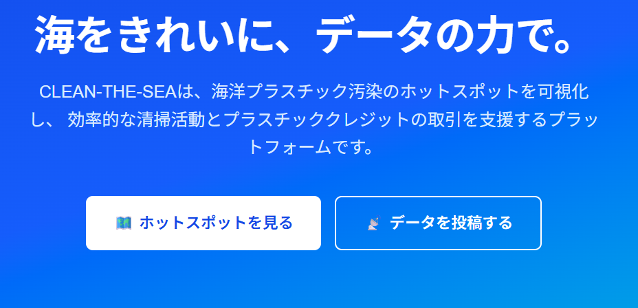
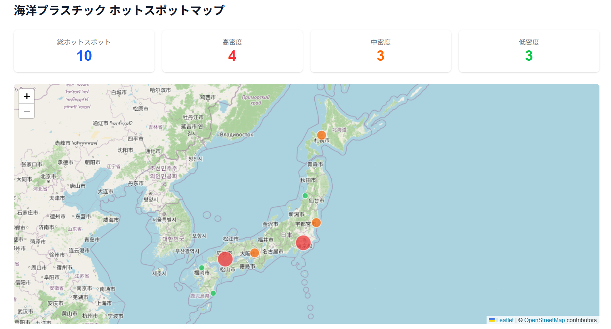
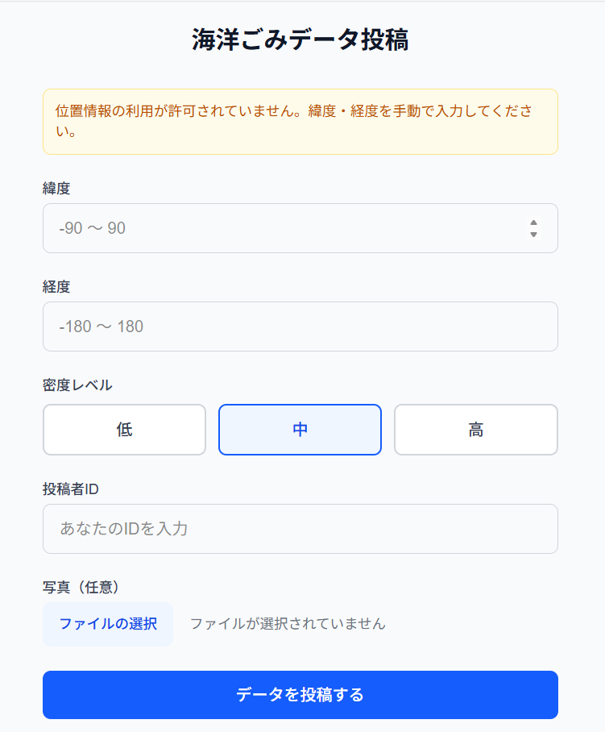
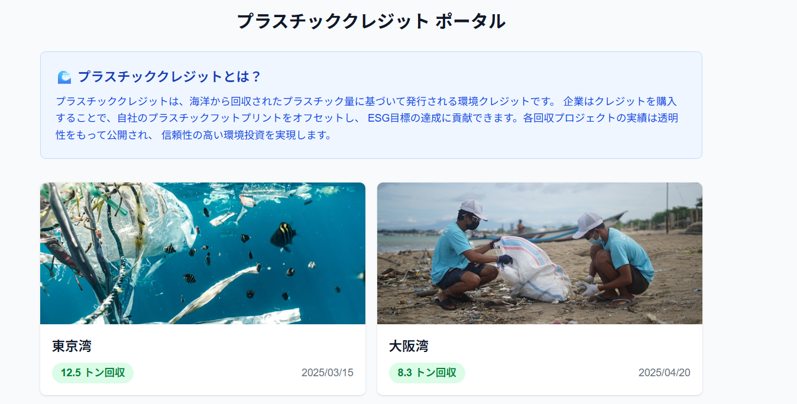

# 🌊 CLEAN-THE-SEA

海洋プラスチック汚染データの可視化・データ収集・クレジット取引MVPプラットフォーム

## スクリーンショット

### ランディングページ


### ホットスポットダッシュボード


### データ投稿フォーム


### プラスチッククレジット ポータル


## 概要

CLEAN-THE-SEAは、海洋プラスチック問題の解決を目指すWebアプリケーションです。
海洋データを用いてプラスチックごみの「ホットスポット」を地図上に可視化し、
効率的な清掃活動を支援するとともに、回収データをESG投資企業向けの
「プラスチッククレジット」として認証・取引できるプラットフォームを提供します。

## 主要機能

| 機能 | 説明 |
|------|------|
| ホットスポットダッシュボード | 海洋プラスチック密度を地図上にリアルタイム可視化。密度に応じた色分けマーカー表示 |
| データ投稿フォーム | スマホ対応。Geolocation APIで位置自動取得、密度レベル選択、写真アップロード |
| マイページ | 投稿ポイントの累計表示と投稿履歴の確認 |
| クレジットポータル | 回収プロジェクト一覧表示とクレジット購入モック（ESG投資企業向け） |

## 技術スタック

| レイヤー | 技術 |
|---------|------|
| フロントエンド | Next.js 16 (App Router), React 19, Tailwind CSS 4 |
| 地図描画 | Leaflet + OpenStreetMap |
| バックエンド | Python (FastAPI) |
| データベース | PostgreSQL + PostGIS（モックデータモード対応） |

## セットアップ

### バックエンド

```bash
cd backend
python -m pip install -r requirements.txt
python -m uvicorn app.main:app --reload
```

デフォルトでモックデータモード（`USE_MOCK=true`）で起動します。
PostgreSQLを使う場合は環境変数 `USE_MOCK=false` に変更してください。

### フロントエンド

```bash
cd frontend
npm install
npm run dev
```

http://localhost:3000 でアクセスできます。

## プロジェクト構成

```
├── backend/
│   ├── app/
│   │   ├── main.py              # FastAPIエントリポイント
│   │   ├── models.py            # SQLAlchemy + GeoAlchemyモデル
│   │   ├── schemas.py           # Pydanticスキーマ
│   │   ├── database.py          # DB接続設定
│   │   ├── mock_data.py         # モックデータ
│   │   └── routers/             # APIルーター
│   ├── migrations/              # SQLマイグレーション
│   └── tests/                   # バックエンドテスト
├── frontend/
│   └── app/
│       ├── page.tsx             # ランディングページ
│       ├── dashboard/page.tsx   # ダッシュボード
│       ├── contribute/page.tsx  # データ投稿
│       ├── mypage/page.tsx      # マイページ
│       ├── credits/             # クレジットポータル
│       └── components/          # 共通コンポーネント
└── docs/screenshots/            # スクリーンショット
```

## API エンドポイント

| メソッド | パス | 説明 |
|---------|------|------|
| GET | `/api/hotspots` | ホットスポット一覧（バウンディングボックスフィルタ対応） |
| POST | `/api/submissions` | データ投稿（写真アップロード対応） |
| GET | `/api/contributors/{id}/points` | 投稿者のポイント・履歴取得 |
| GET | `/api/projects` | 回収プロジェクト一覧 |
| GET | `/api/projects/{id}` | 回収プロジェクト詳細 |
